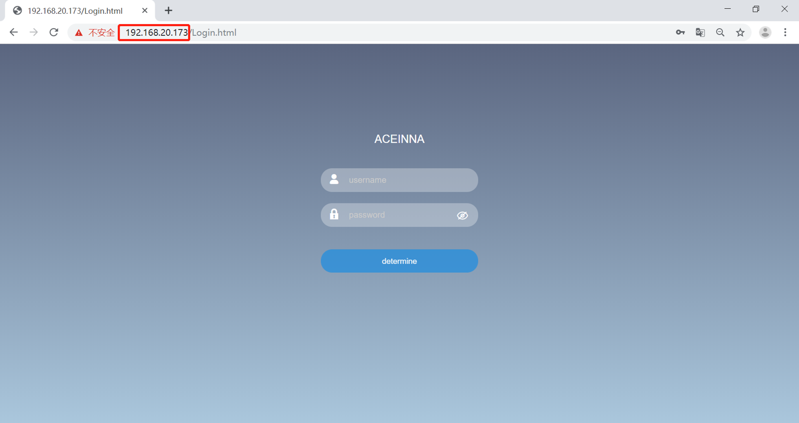

PC Requirement and Network Port Connection
~~~~~~~~~~~~~~~~~~~~~~~~~~~~~~~~~~~~~~~~~~

1. Serial connection. Connect the computer with a serial cable and install the serial cable driver. After the driver is installed, the 
successful serial port recognition will be displayed in the computer's device manager. As the figure shows:

 .. figure:: media/serial_1.png
     :align: center

2. Internet connection. Connect the computer with a network cable or ensure that the receiver and the computer are in the same local 
area network (connect to the same router). After the physical connection is normal, the receiver will automatically 
try to obtain an available IP.

3. Obtain IP information. Using the serial port tool, select the corresponding serial port, and select **460800** for the serial port baud rate. 
Send the **netconfig** command line in the command window to get the board IP information.

 .. figure:: media/ip_info.png
     :align: center

 If you need to set a static IP, you can set it through NETCONFIG. The detailed steps are as follows (assuming the receiver IP address 
 is 192.168.20.173):
  * Enter the following commands to set the receiver IP address, subnet mask and gateway:

    **NETCONFIG STATIC 192.168.20.173 255.255.0.0 192.168.1.1**

  * Save the current configuration:

    **SAVECONFIG**

4. Enter the IP address in the browser (Chrome is recommended), quickly enter the built-in network interface of the board, and 
experience the full graphical, zero-handed interaction mode.

.. note:: The webpage will automatically switch to the local language according to the current computer system language,
 and now supports English, Chinese, Japanese and Norwegian. Other languages can be customized, please contact Aceinna sales team if you need.

Enter the username and password by default:

**username: admin**

**password: password**

*The password can be modified after entering the webpage. If you forget the password, please contact Aceinna technical team.*

