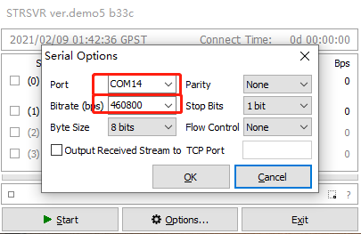
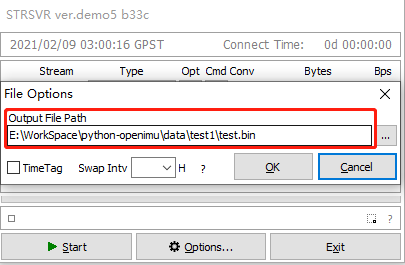
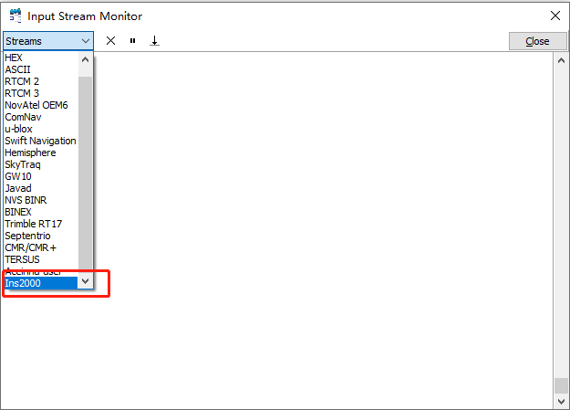
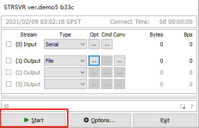
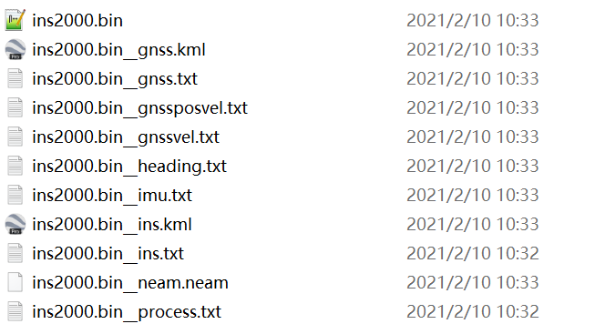

RTKlib tool STRSVR
------------------

strsvr.exe download: https://github.com/Aceinna/rtklib_aceinna/releases

**Using strsvr to save INS2000 data and decode at the same time**

1. Select [serial] from [type] of [input], and then click the [Opt]
button on the right.

.. figure:: ../media/strsvr_1.png
   :alt: Center

2. In the [serial options] dialog box, [port] select the serial port
of ins2000, and [bitrate] select 460800. Click [OK] to save and exit.

3. Click the [CMD] button to open the [serial / TCP commands] dialog
box.

.. figure:: ../media/strsvr_3.png
   :alt: center

4. Check [commands at startup] in the [serial / TCP commands] dialog
box and output configuration parameters in the text box.

::

    unlogall
    NTRIPCONFIG NCOM1 client V1 47.116.1.17:2201 WX02 AceinnaRTK SIGEMZOOMQ1JDJI3
    SETINSTRANSLATION ANT1 -0.28 1.43 1.0 0.20 0.20 0.20
    SETINSTRANSLATION DUALANT 0.7 0.0 0.0 0.20 0.20 0.20
    SETINSROTATION RBV 0.0 0.0 0.0 0.5 0.5 1.0
    SETINSTRANSLATION USER -0.28 1.43 1.0 0.20 0.20 0.20
    INSCOMMAND ENABLE
    LOG RANGECMPB ONTIME 1
    LOG RAWEPHEMB ONCHANGED
    LOG GLOEPHEMERISB ONCHANGED
    LOG GALEPHEMERISB ONCHANGED
    LOG BDSEPHEMERISB ONCHANGED
    LOG QZSSEPHEMERISB ONCHANGED
    LOG INSCONFIGB ONCHANGED
    LOG versionb once
    LOG rxstatusb once
    LOG inspvaxb ontime 0.1
    LOG bestgnssposb ontime 0.1
    LOG bestgnssvelb ontime 0.1
    LOG headingb ontime 0.1
    LOG heading2b ontime 1
    LOG RAWIMUSXB ONNEW
    LOG gpgga ontime 0.1
    LOG NCOM1 gpgga ontime 1
    SAVECONFIG

.. figure:: ../media/strsvr_4.png
   :alt: center

5. [(1)output] select [file], and then click the [Opt] button on the
right.

.. figure:: ../media/strsvr_5.png
   :alt: center

6. In the open [file options] dialog box, select the path to save the
file.

7. Click the small square button in the lower left 
corner.

.. figure:: ../media/strsvr_7.png
   :alt: center

8. In the [input stream monitor] dialog box that pops up, select
[ins2000].

9. Click [start] to start data 
collection.

10. Collect data and decode the generated files in 
real time.

11.If you forget to select [ins2000] in [input stream monitor] and
there is no real-time decoding, you can use the file decoding tool to
decode.

file decoder
download：\ https://github.com/aceinnazhangchen/Ins2000_deocder/releases
