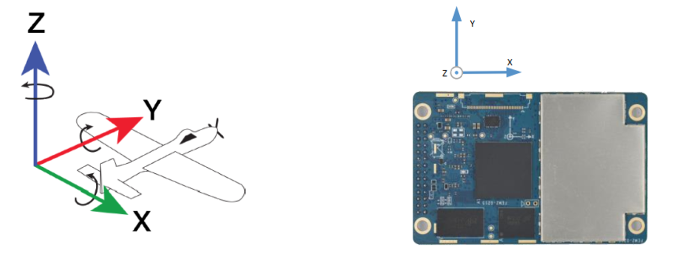
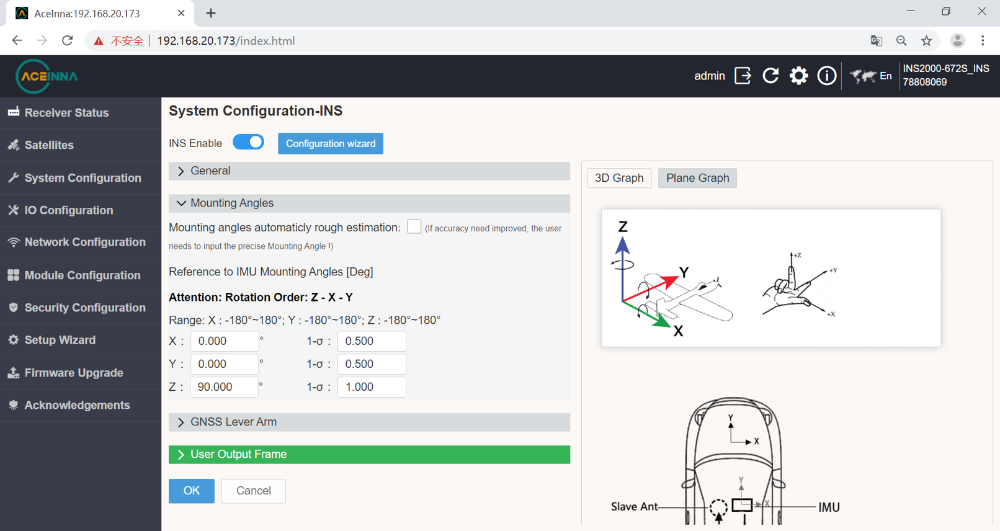
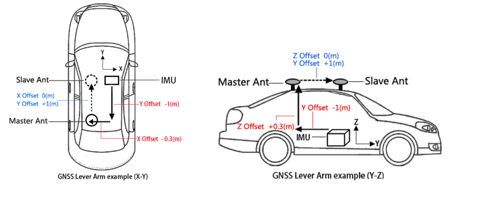
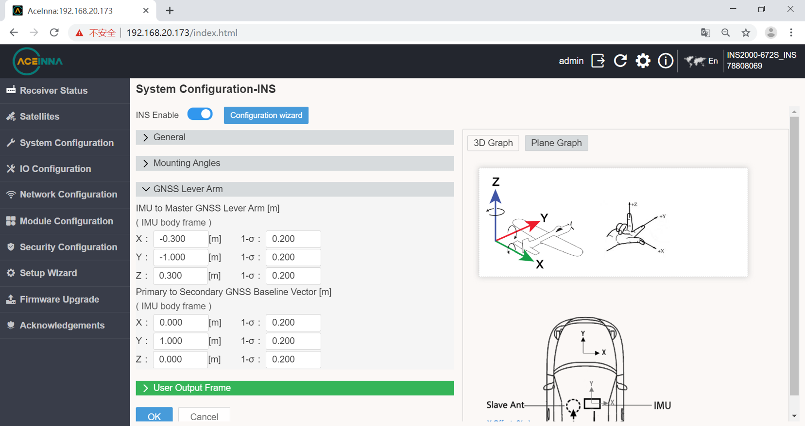
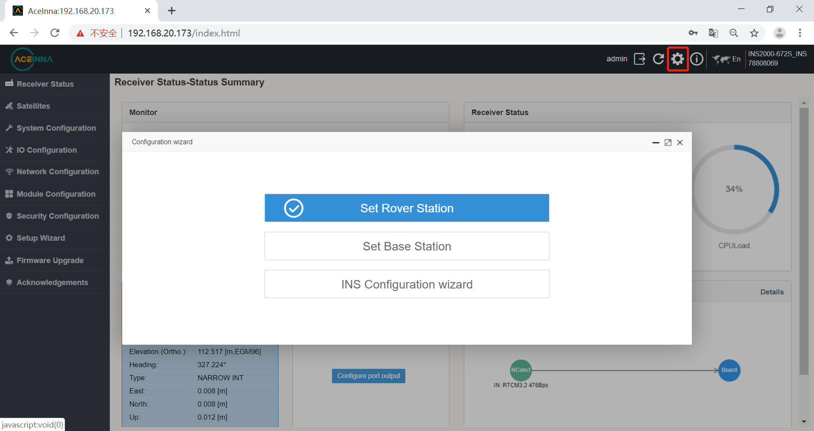
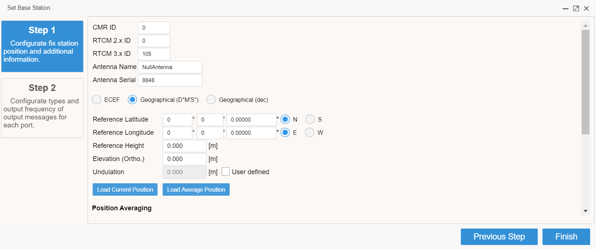
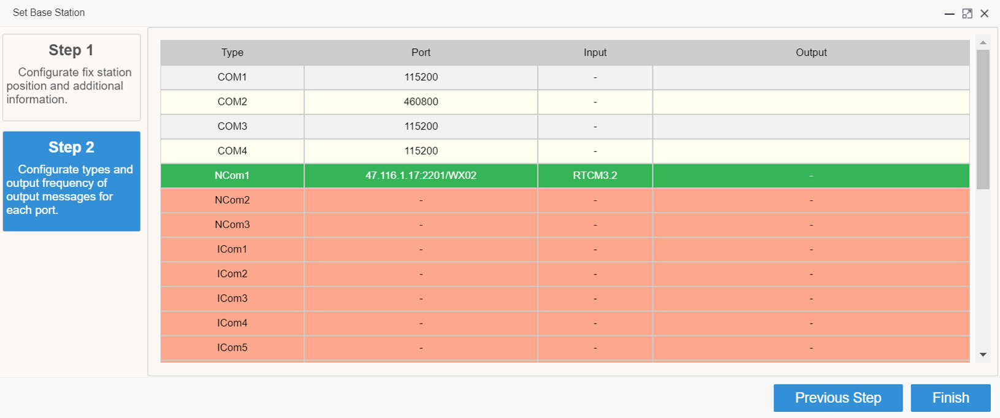
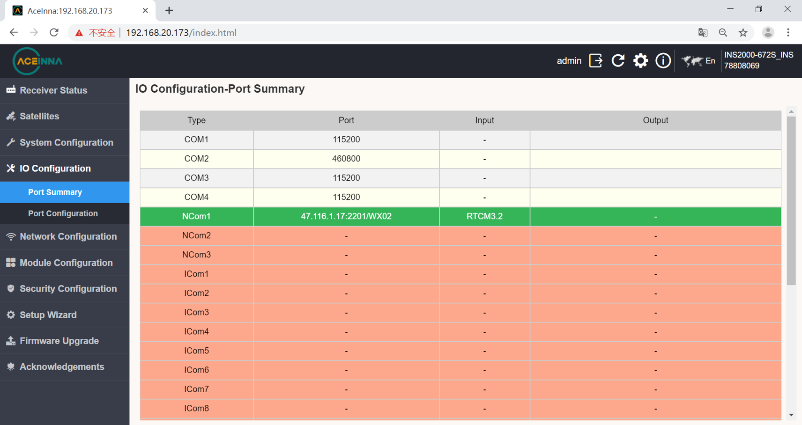
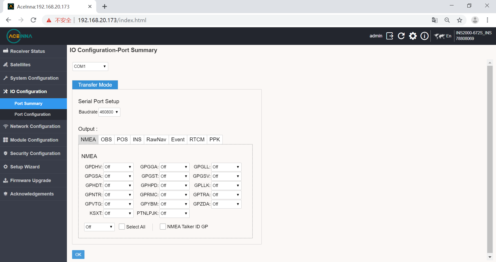

Web configuration
=================

Integrated Navigation Configuration
-----------------------------------

Coordinate System
~~~~~~~~~~~~~~~~~

The board coordinate system uses right-front-up (right-hand coordinate system), and the carrier coordinate system is 
also right-front-up. The positive and negative directions are determined by the right-hand rule. The coordinate system 
is shown in the figure:

Set INS Mounting Angles
~~~~~~~~~~~~~~~~~~~~~~~

Since the coordinate system of the board and the car body may not coincide during use, the *SETINSROTATION* command needs 
to be used to set the rotation vector (installation angle, RBV) between the board and the car body. The board is rotated 
by this rotation vector, which can just coincide with the car body coordinate system.

When the IMU is placed in the car body as shown in the figure abrove, the IMU is rotated 90° around the Z axis in the 
positive direction, and the IMU coordinate system is completely coincident with the car body coordinate system.

Set INS Lever Arm
~~~~~~~~~~~~~~~~~

Since the center of gravity of the board and antenna may not coincide during use, the offset vector (lever arm) parameter 
needs to be configured through the *SETINSTRANSLATION* command.

The following figure is an example to introduce the related configuration of the lever arm.

As can be seen from the above figure, the master antenna is 0.3 meters above the board, 1 meter behind, and 0.3 meters 
on the left.

For boards that support dual antennas, it is also necessary to configure the master-slave antenna offset vector. 
That is, the vector from the master antenna to the slave antenna in the coordinate system represented by the currently 
placed IMU. It can be seen from the above figure that the slave antenna is 1 meter in front of the master antenna 
(the positive direction of the Y-axis of the IMU), and there is no offset along the X/Z-axis of the IMU.

*The rotation vector of the master-slave antenna and the vehicle body or IMU will be automatically calculated 
according to the lever arm parameters configured here.*

RTK Configuration
-----------------

The first time you enter the webpage, there will be a base station and mobile station configuration guide. If you enter it 
for the second time or more, you can select the gear in the upper right corner to export the interface.

Set up base station
~~~~~~~~~~~~~~~~~~~

INS2000 can be used as base station. The configuration procedure is as follows.

The first step is to configure the base station location.

The second step is to configure the output protocol and port.

Set up rover station
~~~~~~~~~~~~~~~~~~~~

Let’s now configure INS2000 as rover with the commonly used CORS station technology, taking Aceinna’s Ntrip as 
an example.

This RTK rover station configuration requires that the INS2000 receiver can be connected to the Internet.

There are two ways for this product to connect to the Internet:

1 Connect the product to a network device such as a mobile router with a network cable.

* Enter the IO configuration interface.

  .. image:: ../media/io_page.png
     :align: center

* Network cable NCOM1 configuration interface.

  .. image:: ../media/ncom1_page.png
     :align: center

2 Connect the 4G antenna and insert the 4G card to configure as follows.

* 4G configuration select COM1 port, click on DTU option.

  .. image:: ../media/DTU_page.png
     :align: center

Data Output Configuration
-------------------------

Enter the IO configuration interface from the web page to select different ports for output configuration.

Choose a different sentence after entering the port.

