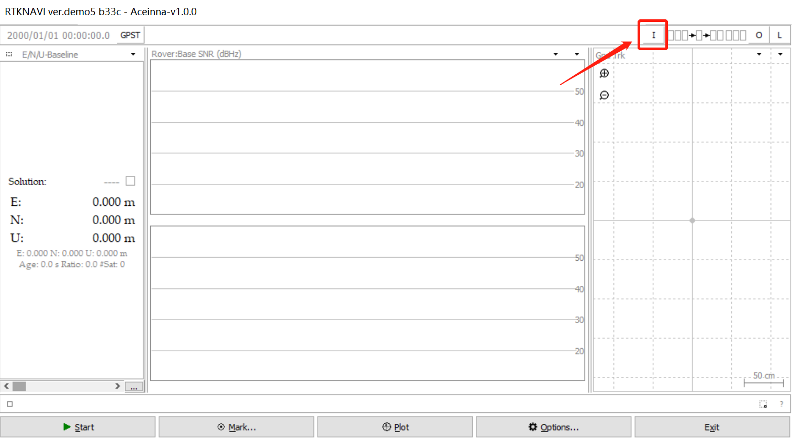
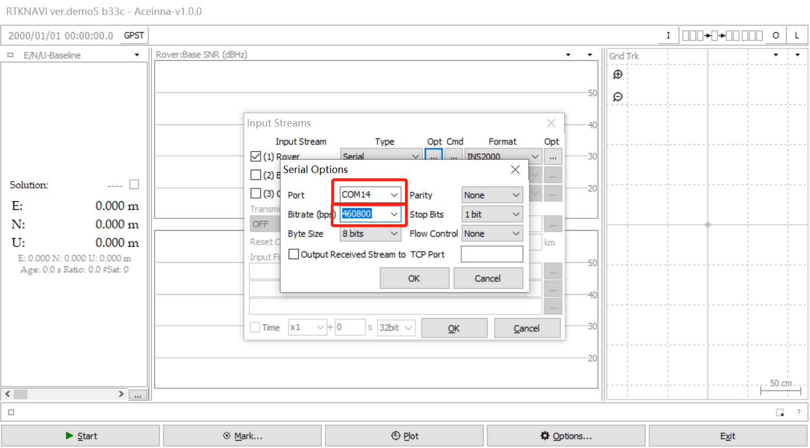
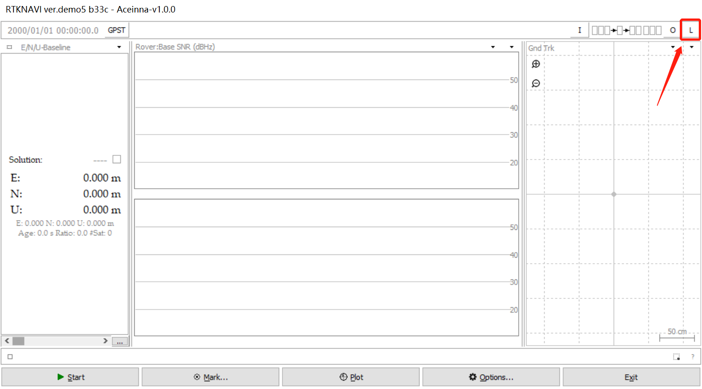
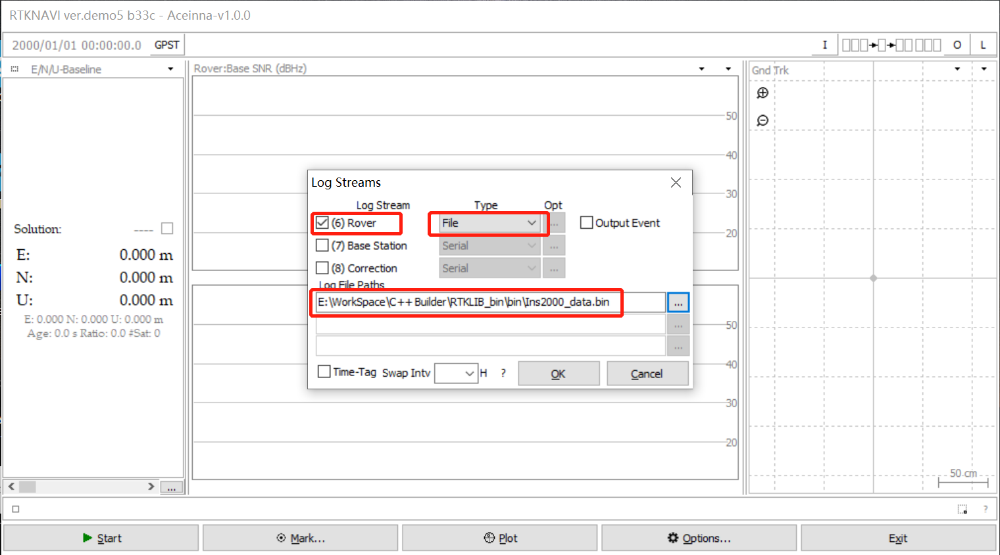

RTKlib tool RTKNAVI
-------------------

rtknavi.exe download: https://github.com/Aceinna/rtklib_aceinna/releases

**Using rtknavi to save INS2000 data and decode at the same time**

1. Click the [i] button in the upper right corner to open the [input
streams] dialog box.

2. Check [(1) Rover], select [serial] for [type], select [ins2000] for
[format], and click [Opt] to open the [serial options] dialog box.

.. figure:: ../media/rtknavi_2.png
   :alt: center

3. [port] select the serial port of ins2000, and [bitrate] select
460800. Click [OK] to close the dialog box.

4. Click the [l] button in the upper right corner to open the [log
streams] dialog box.

.. figure:: ../media/rtknavi_4.png
   :alt: center

5. Check [(6) Rover], [type] select [file], and then select a path to 
save the file, and click [OK] to close the dialog box.

.. figure:: ../media/rtknavi_5.png
   :alt: center

6. Click [start] to start data 
collection.

7. Collect data and decode the generated files in 
real time.

