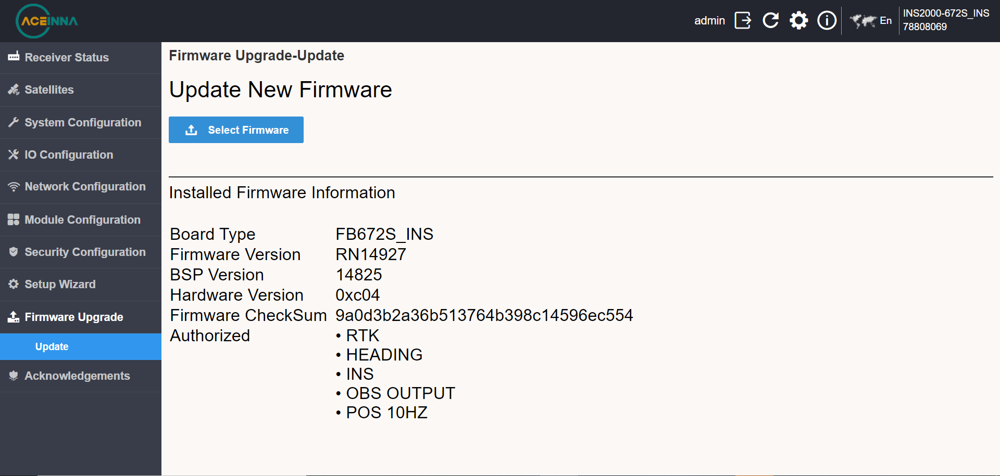
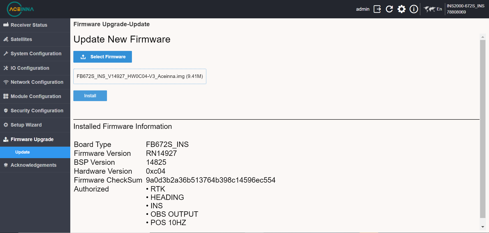
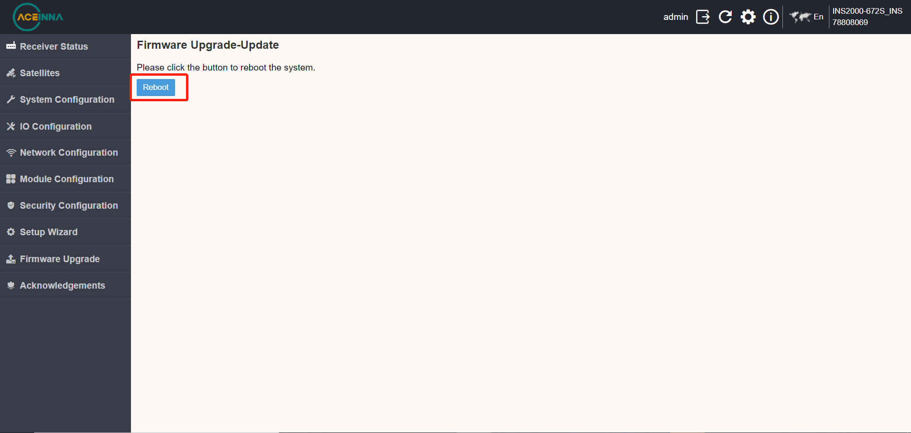

Firmware Update
~~~~~~~~~~~~~~~

Enter the IP address in the browser (Chrome is recommended), then enter the user name and password, and select 
the firmware upgrade to enter the following page.

Select the firmware to be upgraded, as shown in the figure below.

Click [Install] to upgrade the firmware, and click Reboot to restart after the upgrade.

