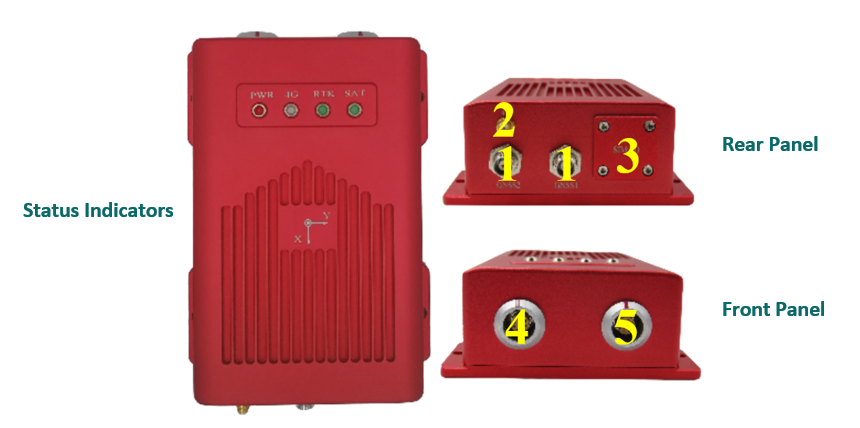

Hardware Description
~~~~~~~~~~~~~~~~~~~~

Physical Specification
^^^^^^^^^^^^^^^^^^^^^^^

+------------------+--------------------+-------------+-----------------------------+
| Dimension        | 174×134×56mm       | Temperature | Operating: -40°~85°         |
+------------------+--------------------+             +-----------------------------+
| Weight           | 950g               |             | Storage: -55°~95°           |
+------------------+--------------------+-------------+-----------------------------+
| Protection Class | IP67               | Vibration   | GKB150.18-2009, MIL-STD-810 |
+------------------+--------------------+-------------+-----------------------------+
| Humidity         | 95% non-condensing | Shock       | GKB150.18-2009, MIL-STD-810 |
+------------------+--------------------+-------------+-----------------------------+

Interface
^^^^^^^^^

+--------------------------+-------------------------------------------+--------------------------+
| Interface                | Description                               | Pin function             |
+--------------------------+-------------------------------------------+--------------------------+
| Front Panel                                                                                     |
+---+----------------------+-------------------------------------------+--------------------------+
| 4 | 10-pin MGG connector | USB, CAN, COM3                            | Refer to the table below |
+---+----------------------+-------------------------------------------+--------------------------+
| 5 | 12-pin MGG connector | Ethernet port, PPS, COM2, power interface | Refer to the table below |
+---+----------------------+-------------------------------------------+--------------------------+
| Rear Panel                                                                                      |
+---+----------------------+-------------------------------------------+--------------------------+
| 1 | NC connectors        | GNSS Dual Antenna                         |                          |
+---+----------------------+-------------------------------------------+--------------------------+
| 2 | SMA connector        | 4G Antenna                                |                          |
+---+----------------------+-------------------------------------------+--------------------------+
| 3 | Card slots           | SD Card, SIM Card                         |                          |
+---+----------------------+-------------------------------------------+--------------------------+
| Status Indicators                                                                               |
+---+----------------------+-------------------------------------------+--------------------------+
|   | PWR                  | Power Indicator                           | Refer to the table below |
+---+----------------------+-------------------------------------------+--------------------------+
|   | 4G                   | 4G signal light                           | Refer to the table below |
+---+----------------------+-------------------------------------------+--------------------------+
|   | RTK                  | RTK indicator                             | Refer to the table below |
+---+----------------------+-------------------------------------------+--------------------------+
|   | SAT                  | Satellite indicator                       | Refer to the table below |
+---+----------------------+-------------------------------------------+--------------------------+

10-pin MGG connector pin function
---------------------------------

+--------+---------------+---------------------------------------+
| Number | Name          | Function                              |
+--------+---------------+---------------------------------------+
|   1    | CAN_L/422_TX- | Bus low/422 send negative             |
+--------+---------------+---------------------------------------+
|   2    | CAN_H/422_TX+ | Bus high/422 sending positive         |
+--------+---------------+---------------------------------------+
|   3    | GND           | Ground                                |
+--------+---------------+---------------------------------------+
|   4    | USB_VBUS      | Bus powered                           |
+--------+---------------+---------------------------------------+
|   5    | USB_ID        | Determine the master and slave device |
+--------+---------------+---------------------------------------+
|   6    | GND           | Ground                                |
+--------+---------------+---------------------------------------+
|   7    | USB_D+        | Data positive                         |
+--------+---------------+---------------------------------------+
|   8    | USB_D-        | Data negative                         |
+--------+---------------+---------------------------------------+
|   9    | TXD3/422_RX-  | Send data/422 receive negative        |
+--------+---------------+---------------------------------------+
|   10   | RXD3/422_RX+  | Receive data/422 receive positive     |
+--------+---------------+---------------------------------------+

12-pin MGG connector pin function
---------------------------------

+--------+----------+-----------------------------------------+
| Number | Name     | Funtion                                 |
+--------+----------+-----------------------------------------+
|   1    | GND      | Ground                                  |
+--------+----------+-----------------------------------------+
|   2    | N/A      | Keep                                    |
+--------+----------+-----------------------------------------+
|   3    | GND      | Ground                                  |
+--------+----------+-----------------------------------------+
|   4    | ETH_TX+  | Ethernet send positive                  |
+--------+----------+-----------------------------------------+
|   5    | ETH_TX-  | Ethernet send negative                  |
+--------+----------+-----------------------------------------+
|   6    | GND      | Ground                                  |
+--------+----------+-----------------------------------------+
|   7    | ETH_RX-  | Ethernet receive negative               |
+--------+----------+-----------------------------------------+
|   8    | ETH_RX+  | Ethernet receiving positive             |
+--------+----------+-----------------------------------------+
|   9    | PPS      | Second pulse                            |
+--------+----------+-----------------------------------------+
|   10   | 12V+     | 12V power input (input voltage 9-36VDC) |
+--------+----------+-----------------------------------------+
|   11   | RXD2     | COM2 receive data                       |
+--------+----------+-----------------------------------------+
|   12   | TXD2     | COM2 send data                          |
+--------+----------+-----------------------------------------+

Antenna and Communication
--------------------------

+-----------+-------------------+-------------------------------------------------------------------+
| Interface | State             | Description                                                       |
+-----------+-------------------+-------------------------------------------------------------------+
| ANT1      | Master antenna    | Master antenna when built-in dual antenna board.                  |
+-----------+-------------------+-------------------------------------------------------------------+
| ANT2      | From the antenna  | When the dual antenna board is built-in, it is the slave antenna. |
+-----------+-------------------+-------------------------------------------------------------------+
| 4G        | 4G signal antenna | 4G signal antenna.                                                |
+-----------+-------------------+-------------------------------------------------------------------+
| SIM       | SIM card slot     | SIM now supports North American and Mainland versions. If you need|
|           |                   | support from other countries, please contact the Aceinna support  |
|           |                   | team for customized production.                                   |
+-----------+-------------------+-------------------------------------------------------------------+

Indicator Satus
---------------

+------------------------------+---------------------+-------------------------------------------------------------------------------------------+ 
| Indicator                    | Status              | Description                                                                               |
+------------------------------+---------------------+-------------------------------------------------------------------------------------------+
|.. figure:: media/sat_ind.png | Satellite indicator || Display the receiver accepts satellites:                                                 |
|                              |                     || 1 No light: no satellite received                                                        |
|                              |                     || 2 Flashing: fewer satellites have been tracked (<12)                                     |
|                              |                     || 3 Steady on: The number of tracked satellites is sufficient (>=12)                       |
+------------------------------+---------------------+-------------------------------------------------------------------------------------------+
|.. figure:: media/rtk_ind.png | RTK indicator       || Display receiver positioning:                                                            |
|                              |                     || 1 Breath (On 3s off 1s) The board is started, no RTCM data access                        |
|                              |                     || 2 High frequency (25Hz) RTCM data access but no fixed solution or floating point solution|
|                              |                     || 3 times high frequency (5Hz) to obtain floating point solution                           |
|                              |                     || 4 Low frequency (1Hz) to obtain a fixed solution                                         |
+------------------------------+---------------------+-------------------------------------------------------------------------------------------+
|.. figure:: media/4g_ind.png  | 4G signal light     || Show receiver 4G signal condition:                                                       |
|                              |                     || 1 Flashing slowly (200ms High / 1800ms Low) Network search                               |
|                              |                     || 2 Slow flashing (1800ms High / 200ms Low) invalid                                        |
|                              |                     || 3 Fast flashing (125ms High / 125ms Low) Data is being transmitted                       |
|                              |                     || 4 Always on Busy                                                                         |
+------------------------------+---------------------+-------------------------------------------------------------------------------------------+
|.. figure:: media/pwr_ind.png | Power Indicator     || Always on, power on                                                                      |
+------------------------------+---------------------+-------------------------------------------------------------------------------------------+

