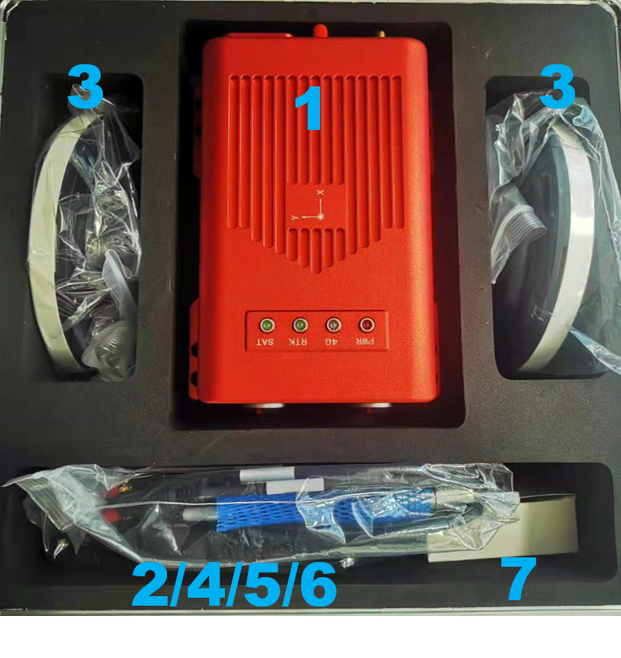

Hardware Setup
~~~~~~~~~~~~~~

Prerequisites
^^^^^^^^^^^^^

+------+--------------------------+----------+----------------------------------------------+
|Number|  Name                    | Quantity | Remarks                                      |
+------+--------------------------+----------+----------------------------------------------+
| 1    | Aceinna INS2000 receiver |    1     |                                              |
+------+--------------------------+----------+----------------------------------------------+
| 2    | 4G antenna               |    1     |                                              |
+------+--------------------------+----------+----------------------------------------------+
| 3    | GNSS antenna             |    2     |                                              |
+------+--------------------------+----------+----------------------------------------------+
| 4    | 10-pin MGG connector     |    1     | USB, CAN, serial port 3                      |
+------+--------------------------+----------+----------------------------------------------+
| 5    | 12-pin MGG connector     |    1     | Network port, PPS, serial port 2, power port |
+------+--------------------------+----------+----------------------------------------------+
| 6    | GNSS antenna feeder      |    2     |                                              |
+------+--------------------------+----------+----------------------------------------------+
| 7    | Power                    |    2     |                                              |
+------+--------------------------+----------+----------------------------------------------+
| 8    | SIM card                 |    1     | prepared by customer                         |
+------+--------------------------+----------+----------------------------------------------+
| 9    | Ethernet cable           |    1     | prepared by customer                         |
+------+--------------------------+----------+----------------------------------------------+
| 10   | Serial line              |    1     | prepared by customer                         |
+------+--------------------------+----------+----------------------------------------------+
| 11   | computer                 |    1     | prepared by customer                         |
+------+--------------------------+----------+----------------------------------------------+

Setup Procedure
^^^^^^^^^^^^^^^

* 1: Install Aceinna INS2000 on the carrier (the advancing direction of the carrier is consistent with the direction of the receiver Y axis);
* 2: Connect Aceinna INS2000 to the GNSS antenna through the GNSS feeder (note that the antenna should be installed in an open and unobstructed place);
.. note:: When the dual antenna board is built-in, ANT1 is the master antenna and ANT2 is the slave antenna.
* 3: Connect Aceinna INS2000 to Internet with a 4G antenna and SIM card or Ethernet cable;
* 4: Connect the network port or serial port to the laptop;
* 5: Power supply 9-36V (12V recommended);
.. note:: Power on after all hardware is successfully connected.
* 6: Perform integrated navigation configuration.
