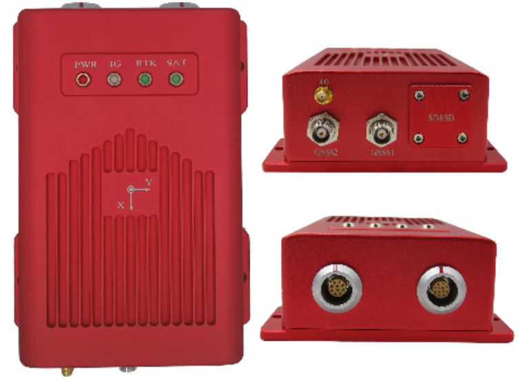

INS2000 Developer Manual
==========================

Aceinna INS2000 Receiver is a robust high precision receiver which supports dual 
frequency from the GPS,BDS,GLONASS and QZSS constellations. This delivers the quickest 
and most reliable RTK initializations for centimeter level positioning and precise heading. 
Mainly facing to applications of high-precision positioning, navigation and mapping, etc. 
Customers benefit from the Ethernet connectivity available on the board, allowing high 
speed data transfer and configuration via standard web browsers. Serial port, USB and CAN 
are also supported. 

**Social:** `Twitter <https://twitter.com/MEMSsensortech>`_ |
`Medium <https://medium.com/@mikehorton>`_ 

.. raw:: latex

   \part{About INS2000}

.. toctree::
    :caption: About INS2000
    :maxdepth: 1
    :hidden:
    :titlesonly:

    intro

.. raw:: latex

   \part{Tutorial}

.. toctree::
    :caption: Tutorial
    :maxdepth: 4
    :hidden:
    :titlesonly:

    quick_start
    useINS2000

.. .. toctree::
    :caption: INS2000 Developer Manual
    :maxdepth: 1

..    user_outline
    base_outline
    ref_outline
    system_setup_guide
    