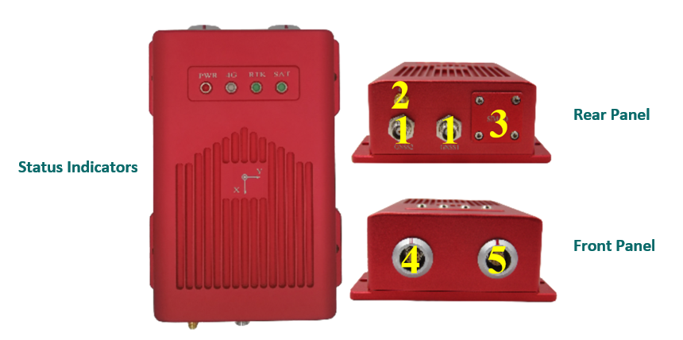
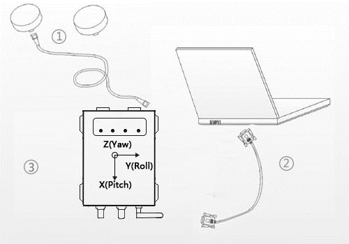
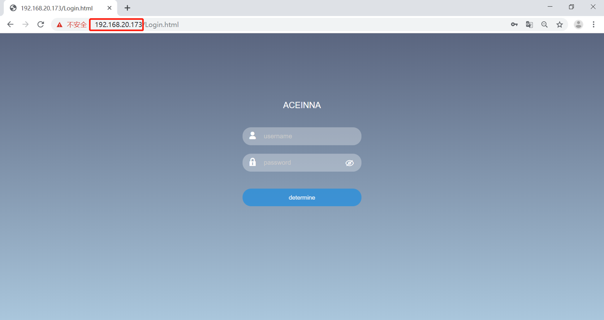
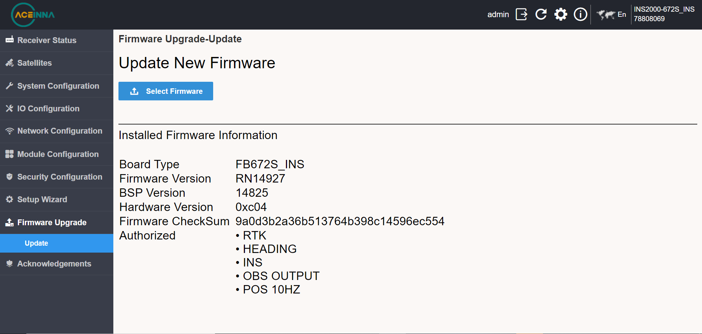
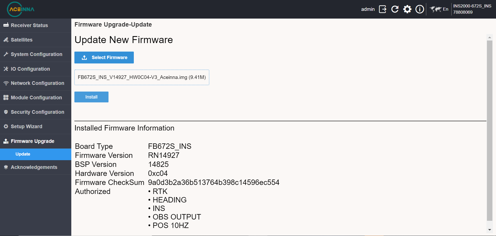
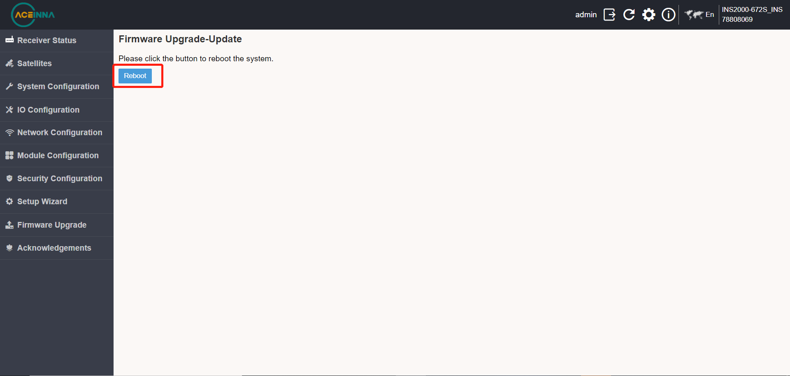

**Note: if the figures are blur, click on the figure to see the clearer version**

Hardware Description
~~~~~~~~~~~~~~~~~~~~

Physical Specification
^^^^^^^^^^^^^^^^^^^^^^^

+------------------+--------------------+-------------+-----------------------------+
| Dimension        | 174×134×56mm       | Temperature | Operating: -40°~85°         |
+------------------+--------------------+             +-----------------------------+
| Weight           | 950g               |             | Storage: -55°~95°           |
+------------------+--------------------+-------------+-----------------------------+
| Protection Class | IP67               | Vibration   | GKB150.18-2009, MIL-STD-810 |
+------------------+--------------------+-------------+-----------------------------+
| Humidity         | 95% non-condensing | Shock       | GKB150.18-2009, MIL-STD-810 |
+------------------+--------------------+-------------+-----------------------------+

Interface
^^^^^^^^^

+--------------------------+-------------------------------------------+--------------------------+
| Interface                | Description                               | Pin function             |
+--------------------------+-------------------------------------------+--------------------------+
| Front Panel                                                                                     |
+---+----------------------+-------------------------------------------+--------------------------+
| 4 | 10-pin MGG connector | USB, CAN, COM3                            | Refer to the table below |
+---+----------------------+-------------------------------------------+--------------------------+
| 5 | 12-pin MGG connector | Ethernet port, PPS, COM2, power interface | Refer to the table below |
+---+----------------------+-------------------------------------------+--------------------------+
| Rear Panel                                                                                      |
+---+----------------------+-------------------------------------------+--------------------------+
| 1 | NC connectors        | GNSS Dual Antenna                         |                          |
+---+----------------------+-------------------------------------------+--------------------------+
| 2 | SMA connector        | 4G Antenna                                |                          |
+---+----------------------+-------------------------------------------+--------------------------+
| 3 | Card slots           | SD Card, SIM Card                         |                          |
+---+----------------------+-------------------------------------------+--------------------------+
| Status Indicators                                                                               |
+---+----------------------+-------------------------------------------+--------------------------+
|   | PWR                  | Power Indicator                           | Refer to the table below |
+---+----------------------+-------------------------------------------+--------------------------+
|   | 4G                   | 4G signal light                           | Refer to the table below |
+---+----------------------+-------------------------------------------+--------------------------+
|   | RTK                  | RTK indicator                             | Refer to the table below |
+---+----------------------+-------------------------------------------+--------------------------+
|   | SAT                  | Satellite indicator                       | Refer to the table below |
+---+----------------------+-------------------------------------------+--------------------------+

10-pin MGG connector pin function
---------------------------------

+--------+---------------+---------------------------------------+
| Number | Name          | Function                              |
+--------+---------------+---------------------------------------+
|   1    | CAN_L/422_TX- | Bus low/422 send negative             |
+--------+---------------+---------------------------------------+
|   2    | CAN_H/422_TX+ | Bus high/422 sending positive         |
+--------+---------------+---------------------------------------+
|   3    | GND           | Ground                                |
+--------+---------------+---------------------------------------+
|   4    | USB_VBUS      | Bus powered                           |
+--------+---------------+---------------------------------------+
|   5    | USB_ID        | Determine the master and slave device |
+--------+---------------+---------------------------------------+
|   6    | GND           | Ground                                |
+--------+---------------+---------------------------------------+
|   7    | USB_D+        | Data positive                         |
+--------+---------------+---------------------------------------+
|   8    | USB_D-        | Data negative                         |
+--------+---------------+---------------------------------------+
|   9    | TXD3/422_RX-  | Send data/422 receive negative        |
+--------+---------------+---------------------------------------+
|   10   | RXD3/422_RX+  | Receive data/422 receive positive     |
+--------+---------------+---------------------------------------+

12-pin MGG connector pin function
---------------------------------

+--------+----------+-----------------------------------------+
| Number | Name     | Funtion                                 |
+--------+----------+-----------------------------------------+
|   1    | GND      | Ground                                  |
+--------+----------+-----------------------------------------+
|   2    | N/A      | Keep                                    |
+--------+----------+-----------------------------------------+
|   3    | GND      | Ground                                  |
+--------+----------+-----------------------------------------+
|   4    | ETH_TX+  | Ethernet send positive                  |
+--------+----------+-----------------------------------------+
|   5    | ETH_TX-  | Ethernet send negative                  |
+--------+----------+-----------------------------------------+
|   6    | GND      | Ground                                  |
+--------+----------+-----------------------------------------+
|   7    | ETH_RX-  | Ethernet receive negative               |
+--------+----------+-----------------------------------------+
|   8    | ETH_RX+  | Ethernet receiving positive             |
+--------+----------+-----------------------------------------+
|   9    | PPS      | Second pulse                            |
+--------+----------+-----------------------------------------+
|   10   | 12V+     | 12V power input (input voltage 9-36VDC) |
+--------+----------+-----------------------------------------+
|   11   | RXD2     | COM2 receive data                       |
+--------+----------+-----------------------------------------+
|   12   | TXD2     | COM2 send data                          |
+--------+----------+-----------------------------------------+

Antenna and Communication
--------------------------

+-----------+-------------------+-------------------------------------------------------------------+
| Interface | State             | Description                                                       |
+-----------+-------------------+-------------------------------------------------------------------+
| ANT1      | Master antenna    | Master antenna when built-in dual antenna board.                  |
+-----------+-------------------+-------------------------------------------------------------------+
| ANT2      | From the antenna  | When the dual antenna board is built-in, it is the slave antenna. |
+-----------+-------------------+-------------------------------------------------------------------+
| 4G        | 4G signal antenna | 4G signal antenna.                                                |
+-----------+-------------------+-------------------------------------------------------------------+
| SIM       | SIM card slot     | SIM now supports North American and Mainland versions. If you need|
|           |                   | support from other countries, please contact the Aceinna support  |
|           |                   | team for customized production.                                   |
+-----------+-------------------+-------------------------------------------------------------------+

Indicator Satus
---------------

+------------------------------+---------------------+-------------------------------------------------------------------------------------------+ 
| Indicator                    | Status              | Description                                                                               |
+------------------------------+---------------------+-------------------------------------------------------------------------------------------+
|.. figure:: media/sat_ind.png | Satellite indicator || Display the receiver accepts satellites:                                                 |
|                              |                     || 1 No light: no satellite received                                                        |
|                              |                     || 2 Flashing: fewer satellites have been tracked (<12)                                     |
|                              |                     || 3 Steady on: The number of tracked satellites is sufficient (>=12)                       |
+------------------------------+---------------------+-------------------------------------------------------------------------------------------+
|.. figure:: media/rtk_ind.png | RTK indicator       || Display receiver positioning:                                                            |
|                              |                     || 1 Breath (On 3s off 1s) The board is started, no RTCM data access                        |
|                              |                     || 2 High frequency (25Hz) RTCM data access but no fixed solution or floating point solution|
|                              |                     || 3 times high frequency (5Hz) to obtain floating point solution                           |
|                              |                     || 4 Low frequency (1Hz) to obtain a fixed solution                                         |
+------------------------------+---------------------+-------------------------------------------------------------------------------------------+
|.. figure:: media/4g_ind.png  | 4G signal light     || Show receiver 4G signal condition:                                                       |
|                              |                     || 1 Flashing slowly (200ms High / 1800ms Low) Network search                               |
|                              |                     || 2 Slow flashing (1800ms High / 200ms Low) invalid                                        |
|                              |                     || 3 Fast flashing (125ms High / 125ms Low) Data is being transmitted                       |
|                              |                     || 4 Always on Busy                                                                         |
+------------------------------+---------------------+-------------------------------------------------------------------------------------------+
|.. figure:: media/pwr_ind.png | Power Indicator     || Always on, power on                                                                      |
+------------------------------+---------------------+-------------------------------------------------------------------------------------------+

Hardware Setup
~~~~~~~~~~~~~~

Prerequisites
^^^^^^^^^^^^^

+--------------------------+----------+----------------------------------------------+
| Name                     | Quantity | Remarks                                      |
+--------------------------+----------+----------------------------------------------+
| Aceinna INS2000 receiver |    1     |                                              |
+--------------------------+----------+----------------------------------------------+
| 4G antenna               |    1     |                                              |
+--------------------------+----------+----------------------------------------------+
| GNSS antenna             |    2     |                                              |
+--------------------------+----------+----------------------------------------------+
| SIM card                 |    1     |                                              |
+--------------------------+----------+----------------------------------------------+
| 10-pin MGG connector     |    1     | USB, CAN, serial port 3                      |
+--------------------------+----------+----------------------------------------------+
| 12-pin MGG connector     |    1     | Network port, PPS, serial port 2, power port |
+--------------------------+----------+----------------------------------------------+
| GNSS antenna feeder      |    2     |                                              |
+--------------------------+----------+----------------------------------------------+
| Ethernet cable           |    1     | prepared by customer                         |
+--------------------------+----------+----------------------------------------------+
| Serial line              |    1     | prepared by customer                         |
+--------------------------+----------+----------------------------------------------+
| computer                 |    1     | prepared by customer                         |
+--------------------------+----------+----------------------------------------------+

Setup Procedure
^^^^^^^^^^^^^^^

* 1: Install the Aceinna INS2000 on the carrier (the advancing direction of the carrier is consistent with the direction of the receiver Y axis);
* 2: Install the Aceinna INS2000 receiver with a 4G antenna;
* 3: Install the Aceinna INS2000 receiver into the SIM card;
.. note:: When installing the SIM card, as shown in the figure, the notch is to the right and the chip is upward.
* 4: Connect theAceinna INS2000 receiver to the GNSS antenna through the GNSS feeder (note that the antenna should be installed in an open and unobstructed place);
.. note:: When the dual antenna board is built-in, ANT1 is the master antenna and ANT2 is the slave antenna.
* 5: Install the Aceinna INS2000 data cable to the Aceinna INS2000;
* 6: Connect the network port or serial port to the laptop;
* 7: Power supply 9-36V (12V recommended);
.. note:: Power on after all hardware is successfully connected.
* 8: Perform integrated navigation configuration.

PC Requirement and Network Port Connection
~~~~~~~~~~~~~~~~~~~~~~~~~~~~~~~~~~~~~~~~~~

1. Serial connection. Connect the computer with a serial cable and install the serial cable driver. After the driver is installed, the 
successful serial port recognition will be displayed in the computer's device manager. As the figure shows:

 .. figure:: media/serial_1.png
     :align: center

2. Internet connection. Connect the computer with a network cable or ensure that the receiver and the computer are in the same local 
area network (connect to the same router). After the physical connection is normal, the receiver will automatically 
try to obtain an available IP.

3. Obtain IP information. Using the serial port tool, select the corresponding serial port, and select **460800** for the serial port baud rate. 
Send the **netconfig** command line in the command window to get the board IP information.

 .. figure:: media/ip_info.png
     :align: center

 If you need to set a static IP, you can set it through NETCONFIG. The detailed steps are as follows (assuming the receiver IP address 
 is 192.168.20.173):
  * Enter the following commands to set the receiver IP address, subnet mask and gateway:

    **NETCONFIG STATIC 192.168.20.173 255.255.0.0 192.168.1.1**

  * Save the current configuration:

    **SAVECONFIG**

4. Enter the IP address in the browser (Chrome is recommended), quickly enter the built-in network interface of the board, and 
experience the full graphical, zero-handed interaction mode.

.. note:: The webpage will automatically switch to the local language according to the current computer system language,
 and now supports English, Chinese, Japanese and Norwegian. Other languages can be customized, please contact Aceinna sales team if you need.

Enter the username and password by default:

**username: admin**

**password: password**

*The password can be modified after entering the webpage. If you forget the password, please contact Aceinna technical team.*

Firmware Update
~~~~~~~~~~~~~~~

Enter the IP address in the browser (Chrome is recommended), then enter the user name and password, and select 
the firmware upgrade to enter the following page.

Select the firmware to be upgraded, as shown in the figure below.

Click [Install] to upgrade the firmware, and click Reboot to restart after the upgrade.

