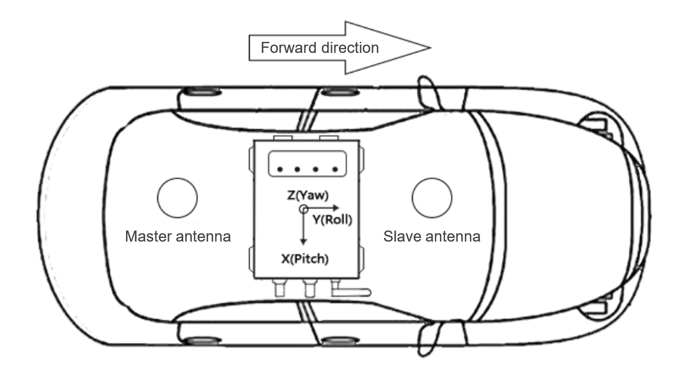

Vehicle Installation
^^^^^^^^^^^^^^^^^^^^

We give a schematic diagram for the scene where the product is installed on the car.

Connect the GNSS antenna, the direction of the Y coordinate axis in the Aceinna INS2000 coordinate system 
is the same as the forward direction of the car body.

**ANT1 is the master antenna placed at the rear of the car, ANT2 is the slave antenna placed at the front of the car.**

